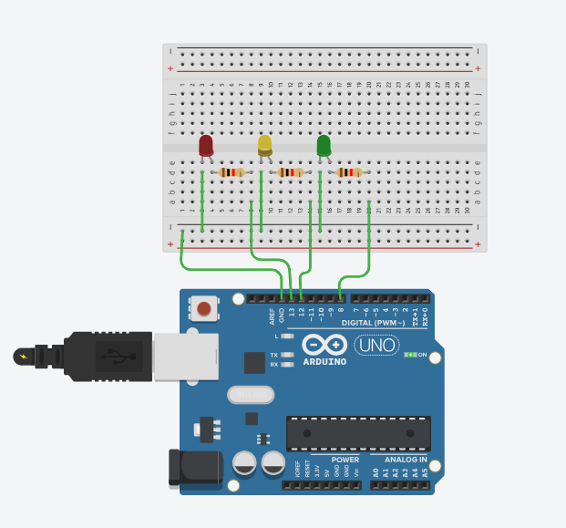
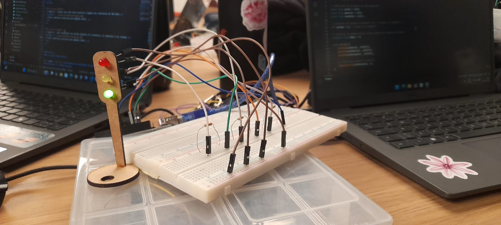
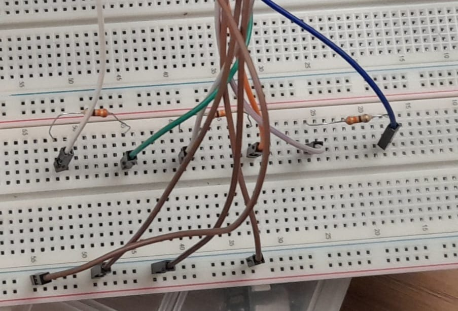

# 🚦Documentação - Semáforo Offline 

- <a href="https://www.linkedin.com/in/mariana-pereira-de-souza1/">Mariana Pereira</a>

## Sumário

[1. Introdução](#c1)

[2. Conceitos](#c2)

[3. Desenvolvimento/Tutorial](#c3)

[4. Avaliação em pares](#c4)

[5. Conclusão](#c5)

## <a name="c1"></a>1. Introdução

&nbsp;&nbsp;&nbsp;&nbsp;Nesse repositório será apresentado o projeto de semáforo offline, com objetivo de aprendizagem em relação a desenvolvimento de soluções IoT. A ideia é apresentarmos uma introdução explicativa sobre o projeto(essa introdução que você está lendo), uma apresentação de conceitos básicos para o entendimento do que está sendo desenvolvido nesse repositório, o desenvolvimento em si, que deve contar com a "Montagem Física do Semáforo" e a "Programação e Lógica do Semáforo", a avaliação em pares que contém a avaliação de duas pessoas distintas em relação ao projeto e a conclusão.

&nbsp;&nbsp;&nbsp;&nbsp;Na atividade que precede o desenvolvimento desse semáforo, tínhamos a seguinte situação problema:

&nbsp;&nbsp;&nbsp;&nbsp;"Você começou a estagiar no Departamento de Engenharia de Trânsito e ficou responsável por controlar o fluxo em uma via movimentada do bairro Butantã. Seu desafio é montar e programar um semáforo que garanta a segurança de pedestres e veículos, seguindo a lógica de tempo de cada fase das luzes, desde a montagem dos LEDs até a programação da sequência correta. Agora, você tem a chance de aplicar seus conhecimentos e desenvolver um sistema essencial para o controle do trânsito. Será que você consegue criar um semáforo que funcione perfeitamente, como aqueles que encontramos nas ruas todos os dias?"

"Você deve programar o comportamento do semáforo para alternar entre as fases vermelho, amarelo e verde, seguindo a lógica abaixo:
- 6 segundos no vermelho
- 4 segundos no verde
- 2 segundos no amarelo"

&nbsp;&nbsp;&nbsp;&nbsp;Portanto, esses são os nossos objetivos ao decorrer dessa documentação, vamos seguir para o início do resumo dos conceitos essenciais para o entendimento da confecção do semáforo.


## <a name="c2"></a>2. Conceitos 

&nbsp;&nbsp;&nbsp;&nbsp;Os conceitos abordados para a feitura do semáforo, tangem conhecimentos referentes a hardware para o desenvolvimento e soluções IoT, a partir de circuitos elétricos e utilização de arduíno.

&nbsp;&nbsp;&nbsp;&nbsp;Juntamente com a parte física, temos o código para a definição das ações a serem seguidas pelo semáforo, como por exemplo a quantia de segundos que cada um fica acesso, em que ordem eles são ligados, quando um é desligado como o próximo deve se comportar, entre outros. Vamos nos encaminhar agora para o desenvolvimento, nele também contamos com mais conceitos técnicos, como a definição de componentes utilizados, a função de cada um no nosso circuito e como foi desenvolvido o código.

## <a name="c3">3. Desenvolvimento

### Parte 1 - Montagem Física do Semáforo

### Componentes utilizados: 

**Tabela 1 – Componentes**

|        Material     |   Descrição  | Função  |                                                  
| :-----------------------: | :-----------------------: | :-----------------------: |
|     `` Led ``     | Pequeno componente eletrônico encapsulado em uma lente de plástico ou resina colorida ou transparente, com dois terminais metálicos (ânodo e cátodo) de comprimentos diferentes. | LED é um componente semicondutor que transforma energia elétrica diretamente em luz de forma eficiente e econômica. |
|     `` Resistores ``     | Geralmente é um pequeno cilindro, marcado com faixas coloridas que indicam seu valor de resistência (em ohms). | O resistor é um componente que limita o fluxo da corrente elétrica no circuito, convertendo o excesso de energia em calor. |
|     `` Protoboard ``     | A protoboard é uma placa plástica perfurada, utilizada para montar e testar circuitos eletrônicos de forma rápida e sem usar solda. | Seus furos são interligados internamente por trilhas metálicas, facilitando a conexão temporária de componentes (como LEDs e resistores) e fios. |
|     `` Jumpers ``     | Jumpers são pequenos cabos condutores usados para fazer as conexões elétricas temporárias entre os componentes de uma protoboard. | Eles vêm em várias cores e três tipos principais (macho-macho, macho-fêmea, fêmea-fêmea) para diferentes tipos de ligação. |
|     `` Arduíno Uno ``     | O Arduino é uma plataforma de hardware (placa) e software (IDE) de código aberto, utilizada para construir projetos eletrônicos interativos. | Ele funciona como um "cérebro" programável, lendo informações de sensores e controlando saídas (como acender LEDs ou motores) em robótica e automação. |
|     `` Cabo USB AB 30cm ``     | O Cabo USB A/B de 30cm é um cabo de dados e alimentação curto com um conector USB Tipo A (retangular padrão) em uma ponta e um USB Tipo B (quadrado/casinha) na outra. | É usado principalmente para conectar periféricos como impressoras, scanners ou placas de desenvolvimento (como o Arduino Uno/Mega) ao computador. |

&nbsp;&nbsp;&nbsp;&nbsp;Após determinarmos, os conceitos e funcionalidadesde cada componente, podemos seguir para mais informações sobre a montagem do modelo pelo TinkerCad, ou seja, uma pré prototipagem antes de iniciar efetivamente a monatagem física.

### Simulação no TinkerCad

**Figura 1 – Preview da simulação com TinkerCad**



[![Clique aqui e acesse o link para ver simulação do semáforo no TinkerCad]](https://www.tinkercad.com/things/bCjwwWSZ2XV-semaforo-offline-simulacao?sharecode=v45DtqToeaOeALB79CvXP3qfbwuYaOAtqgDX2i5XMwA)

### Parte 1 - Montagem Física do Semáforo

[![Clique aqui e acesse o link para o vídeo que demonstra a montage física do semáforo]](https://youtube.com/shorts/fyi--uvNTBM?feature=share)

Acima temos, um vídeo que evidência como a simulação do TinkerCad está em seu desenvolvimento físico e real.

## <a name="c3">3. Tutorial

Agora vamos nos direcionar ao tutorial, para realizar a confecção do semáforo offline, siga as instruções, para que seja possível realizar o seu também!

#### 1. Selecione todos os materiais necessários(componentes)

- Arduíno Uno 
- Protoboard 
- Cabo USB AB 30cm
- Jumpers 
- Leds 
- Mdf do sinal

#### 2. Ligação da protoboard com o Arduíno 

&nbsp;&nbsp;&nbsp;&nbsp;A protoboard, tem como função a montagem de circuitos físicos sem a necessidade de solda, por se tratarem de circuitos temporários. Portanto, seria uma espécie de placa para prototipagem. 

&nbsp;&nbsp;&nbsp;&nbsp;Na protoboard que será feita a montagem do circuito.Primeiramente, vamos entender o funcionamento da protoboard. A protoboard é uma placa de ensaio dividida linhas que contem diversos orifícios que estão interligados eletricamente em filas horizontais ou verticais, variando sobre a área da placa.

&nbsp;&nbsp;&nbsp;&nbsp;Expicitando o que foi citado acima,a parte central da protoboard conhecida como área de conexão, local onde os componentes são inseridos, essa aréa é rotulada por letras e dividida em colunas verticais. Há também a alimentação da protoboard, geralmente marcadas com linha coloridas e símbolos, essas linhas estão conectadas horiontalmente, tanto positivas tanto negativas. 

#### 3. Conectando os led´s

&nbsp;&nbsp;&nbsp;&nbsp;Vamos iniciar conectando os jumpers que precisam estar ligados ao GND do arduíno, no caso a entrada terra, porém essa entrada é apenas uma. Por esse motivo, ligamos os jumpers macho-fêmea a protoboard, a parte macho se conecta na linha negativa enquanto o fêmea irá passar corrente elétrica para o led e ficará conectado ao seu lado negativo. 

Siga o passo a passo para cumprir essa etapa:

- Pegue sua protoboard;
- Localize as linhas horizontais que são responsáveis pela alimentação da placa;
- Conecte um cabo macho-macho no GND (terra) e na protoboard na linha horizontal de alimentação;
- Pegue três fios macho-fêmea, um para cada led do nosso semáforo;
- Conecte a parte macho na linha horizontal de alimentação onde já conectamos anteriormente o fio macho-macho que está conectado ao GND do arduíno; 
- Pegue seus leds e conecte a parte fêmea do jumper a parte negativa do led; 

&nbsp;&nbsp;&nbsp;&nbsp;O led possui uma parte negativa e positiva, e sua parte negativa é o local onde o led tem uma pequena raspagem, nesse projeto utilizados um sinal feito de mdf para conectar nossos leds, por isso o tutorial irá seguir esse caminho, sem conectar os led´s a protoboard, mas saiba que isso também é possível !

&nbsp;&nbsp;&nbsp;&nbsp;Então vamos colocar os leds, na placa de mdf, com a parte raspada para cima, para facilitar a identificação. Agora vamos, resolver a parte positiva

- Pegue seu resistor de duas partes laranjas; 
- Conecte eles as colunas verticais da protoboard, porém esses resistores serão conectados na coluna a , separados um do outro, necessitamos de três resitores, um para cada led;
- Pegue um cabo macho-fêmea conecte em uma ponta do resistor na linha que contem 5 oríficios, pode conectar e qualquer um desses orifícios a frentes( faça isso com todos);
- Agora escolha as portas de conexão do arduíno onde serão conectadas as correntes positivas;
- No meu caso, eu escolhi as portas 8, 12 e 13 
- Agora pegue um cabo macho-macho, conecte uma ponta dele em um lado do resistor e sua outra ponta nas portas do arduíno Uno;
- Pegue seu cabo usb, conecte no arduíno e no computador e logo depois execute o código com o arduíno IDE;
- Não esqueça de conectar seus leds a plaquinha de mdf, para criar seu semáforo;

Ao final da montagem o circuito ele deve estar dessa forma:

**Figura 2 – Semáforo Físico 1**



**Figura 3 – Semáforo Físico 2**



### Código da programação do semáforo

&nbsp;&nbsp;&nbsp;&nbsp;Logo abaixo, você irá identificsr o código reponsável pelo funcionamento do semáforo, que também conta com comentários!

```bash
// Definindo os pinos 
const int LedVerde = 8;
const int LedAmarelo = 12;
const int LedVermelho = 13;

// Definindo as durações em milissegundos
const long verde = 4000;
const long amarelo = 2000;
const long vermelho = 6000; 

// Variável de estado o Vermelho = 0 , o Verde = 1, Amarelo = 2
int estado = 0; // Começa no vermelho

// Variável de temporização último momento da mudança de estado
unsigned long tempo = 0;

void setup() {
    pinMode(LedVerde , OUTPUT);
    pinMode(LedAmarelo , OUTPUT);
    pinMode(LedVermelho , OUTPUT);

    // Inicia no estado 0 vermelho)
    digitalWrite(LedVermelho, 1); 
}

void loop() { 
    // Cálculo do tempo decorrido
    unsigned long agora = millis(); 
    unsigned long decorrido = agora - tempo;
    

    // Estado 0: vermelho
    if (estado == 0) {
        if (decorrido >= vermelho) {
            // Desliga Vermelho, Liga Verde
            digitalWrite(LedVermelho, 0); 
            digitalWrite(LedVerde, 1);  

            estado = 1;      // Vai para o estado verde
            tempo = agora;   // Reseta o timer
        }
    }

    // Estado 1: verde
    else if (estado == 1) { 
        if (decorrido >= verde) {
            // Desliga Verde e liga Amarelo
            digitalWrite(LedVerde, 0);
            digitalWrite(LedAmarelo, 1); 

            estado = 2;      // Vai para o estado amarelo
            tempo = agora;   // Reseta o timer
        }
    }

    // Estado 2: amarelo
    else if (estado == 2) {
        if (decorrido >= amarelo) {
            // Desliga Amarelo e liga Vermelho
            digitalWrite(LedAmarelo, 0);
            digitalWrite(LedVermelho, 1);
            
            estado = 0;      // Volta para o estado vermelho
            tempo = agora;   // Reseta o timer
        }
    }
}
```

## <a name="c4"></a>4. Avaliação em Pares

&nbsp;&nbsp;&nbsp;&nbsp;A avaliação em pares consiste na avaliação e considerações de colegas de classe sobre o projeto desenvolvido, de acordo com a tabela que você irá identificar abaixo que foi disponibilizada pelo professor.

&nbsp;&nbsp;&nbsp;&nbsp;No meu caso, fui avaliada por duas colegas de classe Luana De Jesus Lima e Sarah Araujo Duarte, veja abaixo as tabelas de avaliação:

**Tabela 2 – Avaliação em pares**

#### Avaliador: Luana De Jesus Lima
|Critério|	Contempla (Pontos)|	Contempla Parcialmente (Pontos)	|Não Contempla (Pontos)	|Observações do Avaliador|
|-|-|-|-|-|
|Montagem física com cores corretas, boa disposição dos fios e uso adequado de resistores	|Até 3	|Até 1,5	|0 | Comtempla todos os critérios |	
|Temporização adequada conforme tempos medidos com auxílio de algum instrumento externo	|Até 3	|Até 1,5	|0 | Comtempla todos os critérios |	
|Código implementa corretamente as fases do semáforo e estrutura do código (variáveis representativas e comentários) |	Até 3|	Até 1,5 |	0 | Comtempla todos os critérios |	
|Ir além: Implementou um componente de extra, fez com millis() ao invés do delay() e/ou usou ponteiros no código |	Até 1 |	Até 0,5 |	0 | Comtempla todos os critérios |	
| | | | |Pontuação Total: 10|

**Tabela 3 – Avaliação em pares**

#### Avaliador: Sarah Araujo Duarte
|Critério|	Contempla (Pontos)|	Contempla Parcialmente (Pontos)	|Não Contempla (Pontos)	|Observações do Avaliador|
|-|-|-|-|-|
|Montagem física com cores corretas, boa disposição dos fios e uso adequado de resistores	|Até 3	|Até 1,5	|0 | Comtempla todos os critérios |	
|Temporização adequada conforme tempos medidos com auxílio de algum instrumento externo	|Até 3	|Até 1,5	|0 | Comtempla todos os critérios |	
|Código implementa corretamente as fases do semáforo e estrutura do código (variáveis representativas e comentários) |	Até 3|	Até 1,5 |	0 | Comtempla todos os critérios |	
|Ir além: Implementou um componente de extra, fez com millis() ao invés do delay() e/ou usou ponteiros no código |	Até 1 |	Até 0,5 |	0 | Comtempla todos os critérios |	
| | | | |Pontuação Total: 10|

&nbsp;&nbsp;&nbsp;&nbsp;As avaliadoras, não deram mais considerações sobre o projeto. Porém avaliaram com total todos os critérios de avaliação disponibilizados.

<a name="c5"></a>5. Conclusão

&nbsp;&nbsp;&nbsp;&nbsp;Pronto! Podemos concluir projeto por inteiro, vários conhecimentos importantes para a confecção de circuito foram levantadas hoje. A relização do projeto do semáforo, permitiu elucidar diversos conhecimentos desenvolvidos por mim até agora. Portanto, agradeço a oportunidade de aprendizado.
