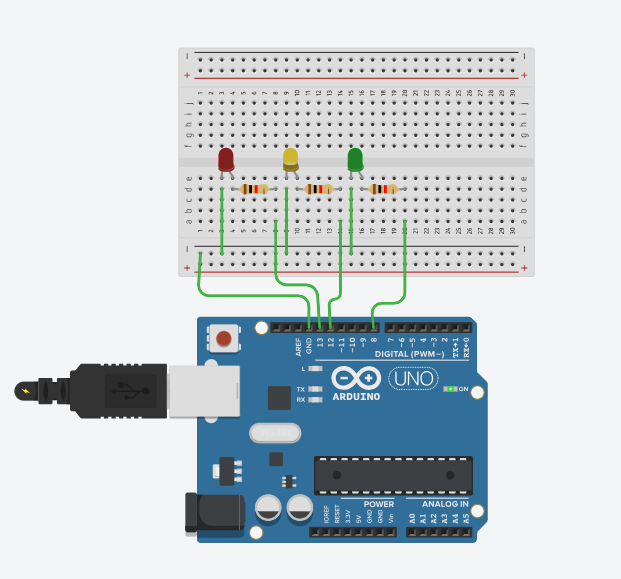

# 🚦Documentação - Semáforo Offline 

- <a href="https://www.linkedin.com/in/mariana-pereira-de-souza1/">Mariana Pereira</a>

## Sumário

[1. Introdução](#c1)

[2. Conceitos](#c2)

[3. Desenvolvimento](#c3)

[4. Avaliação em pares](#c4)

[5. Conclusão](#c5)

## 1. Introdução

&nbsp;&nbsp;&nbsp;&nbsp;Nesse repositório será apresentado o projeto de semáforo offline, com objetivo de aprendizagem em relação a desenvolvimento de soluções IoT. A ideia é apresentarmos uma introdução explicativa sobre o projeto(essa introdução que você está lendo), uma apresentação de conceitos básicos para o entendimento do que está sendo desenvolvido nesse repositório, o desenvolvimento em si, que deve contar com a "Montagem Física do Semáforo" e a "Programação e Lógica do Semáforo", a avaliação em pares que contém a avaliação de duas pessoas distintas em relação ao projeto e a conclusão.

&nbsp;&nbsp;&nbsp;&nbsp;Na atividade que precede o desenvolvimento desse semáforo, tínhamos a seguinte situação problema:

&nbsp;&nbsp;&nbsp;&nbsp;"Você começou a estagiar no Departamento de Engenharia de Trânsito e ficou responsável por controlar o fluxo em uma via movimentada do bairro Butantã. Seu desafio é montar e programar um semáforo que garanta a segurança de pedestres e veículos, seguindo a lógica de tempo de cada fase das luzes, desde a montagem dos LEDs até a programação da sequência correta. Agora, você tem a chance de aplicar seus conhecimentos e desenvolver um sistema essencial para o controle do trânsito. Será que você consegue criar um semáforo que funcione perfeitamente, como aqueles que encontramos nas ruas todos os dias?"

&nbsp;&nbsp;&nbsp;&nbsp;Portanto, esses são os nossos objetivos ao decorrer dessa documentação, vamos seguir para o início do resumo dos conceitos essenciais para o entendimento da confecção do semáforo.

## 2. Conceitos 

&nbsp;&nbsp;&nbsp;&nbsp;Os conceitos abordados para a feitura do semáforo, tangem conhecimentos referentes a hardware para o desenvolvimento e soluções IoT, a partir de circuitos elétricos e utilização de arduíno.

&nbsp;&nbsp;&nbsp;&nbsp;Juntamente com a parte física, temos o código para a definição das ações a serem seguidas pelo semáforo, como por exemplo a quantia de segundos que cada um fica acesso, em que ordem eles são ligados, quando um é desligado como o próximo deve se comportar, entre outros. Vamos nos encaminhar agora para o desenvolvimento, nele também contamos com mais conceitos técnicos, como a definição de componentes utilizados, a função de cada um no nosso circuito e como foi desenvolvido o código.

## <a name="c3">3. Desenvolvimento

### Parte 1 - Montagem Física do Semáforo

### Componentes utilizados: 

|        Material     |   Descrição  | Função  |                                                  
| :-----------------------: | :-----------------------: | :-----------------------: |
|     `` Led ``     | Pequeno componente eletrônico encapsulado em uma lente de plástico ou resina colorida ou transparente, com dois terminais metálicos (ânodo e cátodo) de comprimentos diferentes. | LED é um componente semicondutor que transforma energia elétrica diretamente em luz de forma eficiente e econômica. |
|     `` Resistores ``     | Geralmente é um pequeno cilindro, marcado com faixas coloridas que indicam seu valor de resistência (em ohms). | O resistor é um componente que limita o fluxo da corrente elétrica no circuito, convertendo o excesso de energia em calor. |
|     `` Protoboard ``     | A protoboard é uma placa plástica perfurada, utilizada para montar e testar circuitos eletrônicos de forma rápida e sem usar solda. | Seus furos são interligados internamente por trilhas metálicas, facilitando a conexão temporária de componentes (como LEDs e resistores) e fios. |
|     `` Protoboard ``     | A protoboard é uma placa plástica perfurada, utilizada para montar e testar circuitos eletrônicos de forma rápida e sem usar solda. | Seus furos são interligados internamente por trilhas metálicas, facilitando a conexão temporária de componentes (como LEDs e resistores) e fios. |
|     `` Jumpers ``     | Jumpers são pequenos cabos condutores usados para fazer as conexões elétricas temporárias entre os componentes de uma protoboard. | Eles vêm em várias cores e três tipos principais (macho-macho, macho-fêmea, fêmea-fêmea) para diferentes tipos de ligação. |
|     `` Arduíno Uno ``     | O Arduino é uma plataforma de hardware (placa) e software (IDE) de código aberto, utilizada para construir projetos eletrônicos interativos. | Ele funciona como um "cérebro" programável, lendo informações de sensores e controlando saídas (como acender LEDs ou motores) em robótica e automação. |
|     `` Cabo USB AB 30cm ``     | O Cabo USB A/B de 30cm é um cabo de dados e alimentação curto com um conector USB Tipo A (retangular padrão) em uma ponta e um USB Tipo B (quadrado/casinha) na outra. | É usado principalmente para conectar periféricos como impressoras, scanners ou placas de desenvolvimento (como o Arduino Uno/Mega) ao computador. |

&nbsp;&nbsp;&nbsp;&nbsp;Após determinarmos, os conceitos e funcionalidadesde cada componente, podemos seguir para mais informações sobre a montagem do modelo pelo TinkerCad, ou seja, uma pré prototipagem antes de iniciar efetivamente a monatagem física.

### Simulação no TinkerCad

**Figura 1 – Código do Blink Interno**

[![Clique aqui e acesse o link para ver simulação do semáforo no TinkerCad]](https://www.tinkercad.com/things/bCjwwWSZ2XV-semaforo-offline-simulacao?sharecode=v45DtqToeaOeALB79CvXP3qfbwuYaOAtqgDX2i5XMwA)
